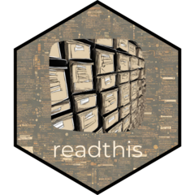

# readthis <a href="https://pawelqs.github.io/readthis/"></a>

<!-- badges: start -->
[](https://github.com/pawelqs/readthis/actions/workflows/R-CMD-check.yaml)
[](https://github.com/pawelqs/readthis/actions/workflows/test-coverage.yaml)
[](https://lifecycle.r-lib.org/articles/stages.html#experimental)
<!-- badges: end -->

The goal of readthis is to provide functions for convenient reading outputs from
programs and algorithms such as CliP, Strelka ect.


## Installation

You can install the development version of readthis from [GitHub](https://github.com/) with:

``` r
devtools::install_github("pawelqs/readthis")
```


## Currently supported algorithms and tools

**Variant Callers:**

- [Strelka2](https://github.com/Illumina/strelka) (somatic SNVs only): `read_strelka_somatic_snvs()`
- [Mutect2](https://github.com/Illumina/strelka) SNVs: `read_mutect_snvs()`
- [FACETS](https://github.com/mskcc/facets) CNVs: `read_facets_cnvs()`
- [ASCAT](https://github.com/VanLoo-lab/ascat) CNVs: `read_ascat_files()` (does not work with all the files)

**Other tools:**

- [CliP](https://github.com/wwylab/CliP) is an algorithm for clonal structure identification through penalizing pairwise differences:
  - `read_clip_all()`
  - `read_clip_all_wide()`
  - `read_clip_best_lambda()`


## Interface

In most functions, the first argument can be either:

- path to a single file
- vector of file paths, element names will be used as patient IDs/sample IDs
- path to a directory containing multiple files, patient/sample IDs will be guessed from the file names.

See the function's help pages (e.g. `?read_strelka_somatic_snvs`) for more details.


## Example

``` r
library(readthis)
dir <- system.file("CliP", package = "readthis")
read_clip_best_lambda(dir)
```

